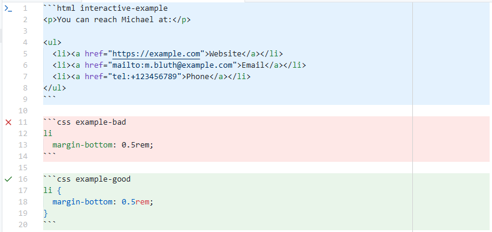
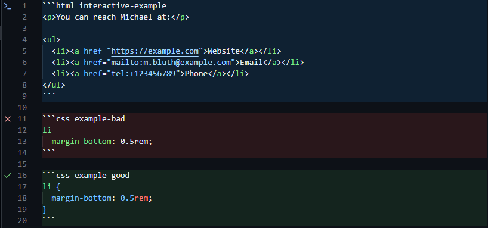
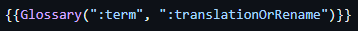
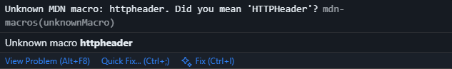
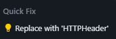
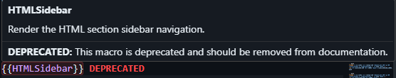
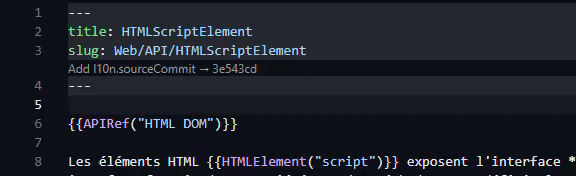
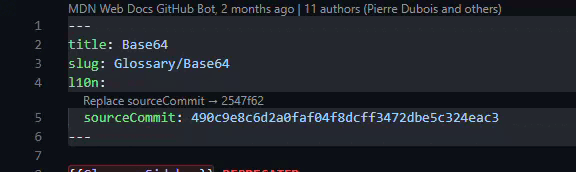

# MDN Macros Syntax VSCode Extension

This extension provides syntax highlighting and snippets for MDN Macros in Visual Studio Code.

## Features

### Code Highlighting

The MDN code blocks have 3 keyword types: `interactive-example`, `example-bad`, and `example-good`. Each keyword type has its own color scheme for better readability.




### Macros snippets and syntax coloring

All MDN Macros have snippets and syntax coloring to help you write MDN Macros quickly and accurately.

For example, trying to type `{{Glossary` will suggest the full macro with a description:



The plugin also provide a typo explainer when a macro is not recognized:

```md example-bad
{{glossary("")}} // Unknown MDN macro: glossary. Did you mean 'Glossary'? `mdn-macros(unknownMacro)`
```

```md example-good
{{Glossary("")}}
```

### Quick fix macros

When a macro is not recognized, a quick fix suggestion is provided to replace it with the correct macro name:





### Deprecated macros warning

When a deprecated macro is used, a warning is shown on hover with information about the deprecation and suggested alternatives.



### Source commit code lens

When you're in the localization folder, inside a Markdown document, the frontmatter will show a code lens indicating the source commit hash from the latest english version if your hash is outdated or missing.

| Adding hash                                         | Updating hash                                         |
| --------------------------------------------------- | ----------------------------------------------------- |
|  |  |
